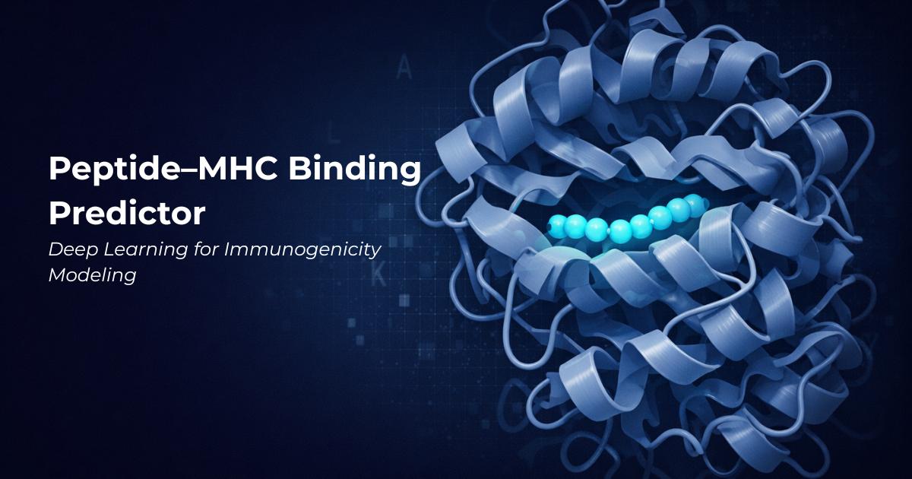

# Peptide-MHC Class I Binding Predictor

Predicts whether a short peptide will bind a given human MHC class I (HLA)
molecule — the step that determines which fragments of a protein get displayed
to T cells. The trained model runs **entirely in the browser**; there is no
backend, no database, and no server to wake up.

**Live:** [peptide.arditmishra.com](https://peptide.arditmishra.com)

> Research and educational use only. This is not a clinical or diagnostic tool.

---

## What it does

Given a peptide (8-11 residues) and an HLA allele, the app returns a calibrated
probability that the pair binds with IC50 < 500 nM, plus how many training
measurements back that particular allele.

The allele is encoded as its **34-residue pseudo-sequence** — the binding-groove
residues that actually contact the peptide, the representation NetMHCpan
introduced. This makes the model genuinely allele-conditioned. The clearest
evidence is a control: the influenza epitope `GILGFVFTL` scores **0.906** on
HLA-A\*02:01, its real restricting allele, and **0.194** on HLA-B\*07:02.

## Model

| | |
|---|---|
| Algorithm | XGBoost, 800 trees |
| Training data | MHCflurry-curated public binding affinities |
| Rows / alleles | 120,000 / 129 HLA-A, -B, -C |
| Split | peptide-grouped 80/20 — no peptide in both train and test |
| **Held-out ROC-AUC** | **0.9188** |
| **Held-out PR-AUC** | **0.8085** |

A single held-out evaluation. Full numbers, limitations, and the biological
sanity checks are in [BENCHMARKS.md](BENCHMARKS.md).

**What this model does not do:** on an allele withheld from training entirely
(leave-one-allele-out), macro ROC-AUC drops to 0.842 — noticeably worse, and
worse still for HLA-C (0.749), the least-represented locus. Allele support is
uneven — HLA-A\*02:01 has 14,387 training measurements and the long tail has a
few hundred — so the app shows the count for whatever allele you pick. Only
quantitative affinity data was used; mass-spectrometry ligand data, which
modern predictors lean on heavily, was excluded.

## Client-side inference

An XGBoost-trained model, exported to a compact tree representation and executed
locally in TypeScript (`shared/pmhc-predictor.ts`). No ML runtime is loaded in the
browser — no XGBoost build, no ONNX, no WASM — just a traversal of the exported
trees. Predictions happen on your machine.

Three separate checks, because they prove different things:

```bash
# 1. Runtime parity: the shipped predictor against the original Python model
node --experimental-strip-types scripts/verify-parity.mjs
uv run --with xgboost --with "numpy<2" python scripts/verify_parity.py

# 2. Export format, and 3. runtime boundaries (40 tests)
node --experimental-strip-types --test "scripts/tests/*.test.mjs"
```

**Runtime parity.** 516 peptide/allele pairs across all 129 alleles, lengths 8–11,
scored by `PeptideMHCPredictor` — the class the app actually ships — and compared
against the XGBoost booster it was exported from:

| | |
|---|---|
| max \|python − typescript\| | **7.481e-08** |
| mean | **1.097e-08** |
| tolerance (fails above) | **1e-06** |
| worst pair | `KCMKIFMWCQT` / `HLA-A*02:19` |

That residual is float32 rounding in the tree-sum accumulation, not a logic
difference.

Until 2026-09-04 the harness reimplemented the traversal itself rather than
importing the shipped class, so the figure measured agreement between Python and
the *harness*. The number is unchanged — the shipped path was in fact correct —
but it is now measured rather than assumed. The standalone traversal survives as
an export-format test, which is what it always was.

**Export format.** `scripts/tests/export-format.test.mjs` reads the artifact with
an independent minimal traversal and reproduces the shipped predictor exactly
(max difference **0.0** over the same 516 pairs), confirming the JSON is
self-describing enough to score from without the app's code.

**Runtime boundaries.** `scripts/tests/runtime-boundaries.test.mjs` covers refusal:
an allele absent from training has no pseudo-sequence, so its 34 allele features
encode as all-zero and the model would still return a confident-looking number
from the peptide alone. The predictor flags it and the caller refuses, rather than
serving a prediction about a blank.

Inference costs roughly **0.1 ms** per prediction — 0.094 and 0.125 ms on two
consecutive runs of the same machine, so it is quoted to one figure rather than
three. `verify-parity.mjs` prints the exact value for the run you just did. The model is a 2.6 MB JSON
(**658 KB** gzipped) fetched on first prediction rather than at page load; the
allele table is a further 12 KB.

## Why no backend

The app used to ship an Express server. It ran a scoring function, kept records
in a hashmap, and returned stubs for integrations that did not exist — none of
which needs a server. It also carried a Drizzle/Postgres layer that was never
reachable: the request handlers talked to an in-memory store and `db.ts` was
never imported.

Removing it dropped 24 dependencies and made the app a static site: no cold
start, no database to keep alive, no environment secrets, and nothing to
monitor. Saved predictions now live in `localStorage`, so unlike the old
in-memory store they survive a reload.

## Running locally

```bash
npm ci
npm run dev      # vite dev server
npm run build    # static bundle in dist/public
npm run check    # typecheck
```

Any static host will serve `dist/public`.

## Project layout

```
client/
  public/models/     pmhc_model.json (trees) + pmhc_alleles.json (pseudo-sequences)
  src/lib/
    pmhc-model.ts    lazy asset loader
    local-backend.ts in-browser request handlers
shared/
  pmhc-predictor.ts  exported-tree traversal + feature encoding (the shipped runtime)
  schema.ts          Zod request/response shapes
scripts/
  verify-parity.mjs  scores fixed pairs via the SHIPPED PeptideMHCPredictor
  verify_parity.py   same pairs via the original XGBoost booster
  tests/             export-format and runtime-boundary tests
```

Training code lives outside this repo in `ml-training/peptide-mhc/`
(`train_baseline.py`, `export_for_browser.py`).

## Honest scope

Things this app deliberately does not pretend to do:

- **No IEDB / UniProt / PDB integration.** Those endpoints return
  "not connected" rather than fabricated records.
- **The peptide designer generates uniformly random sequences** and scores them
  with the model. It is not a generative or optimization method.
- **Motif-enrichment p-values** on the analysis page are static illustrative
  examples, labelled as such in the UI.

### Previous versions

Earlier revisions of this project presented five model architectures (CNN,
BiLSTM, Transformer, and two hybrids) and reported 94.2% accuracy / 0.941 AUC.
Those architectures were never trained — every prediction came from
`Math.random()` — and the metrics did not come from any training run. A later
revision replaced them with a clearly-labelled deterministic placeholder, and
briefly cited an ESM-2 result (0.922 AUC) for which no artifact could be found.

All of it has been removed. Every number in this repository now traces to a
script in it. This note stays here because deleting the history would be its own
kind of dishonesty.

## License

MIT — see [LICENSE](LICENSE).
